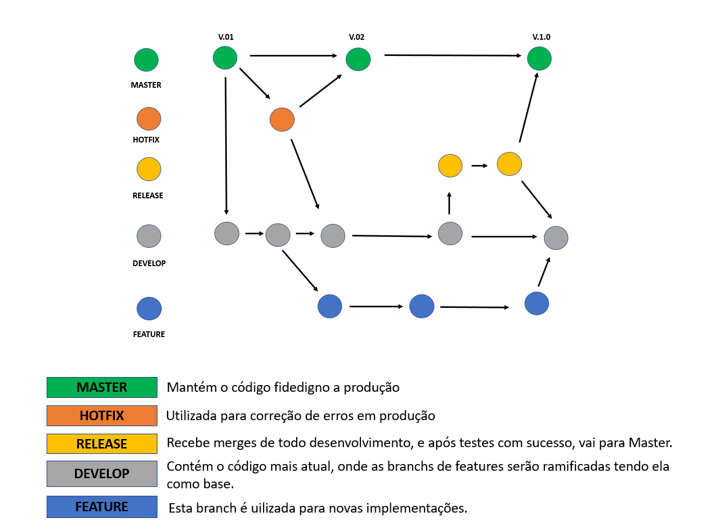
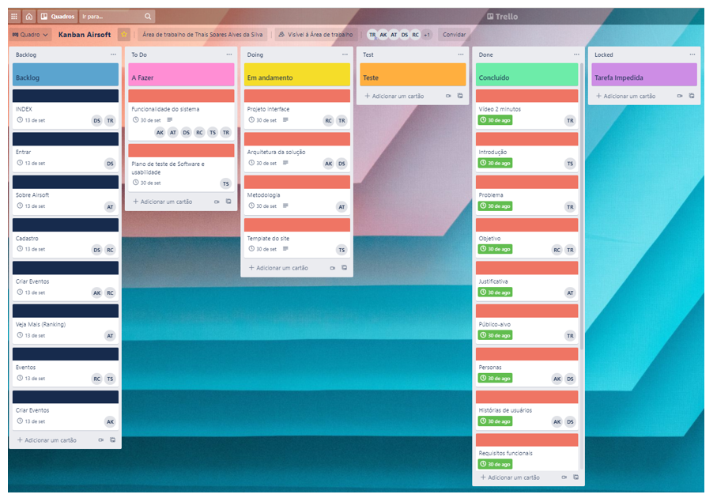

# Metodologia
A Metodologia reflete as definições do ferramental utilizado pelo grupo tanto para a manutenção dos códigos e diferentes artefatos como para a associação e compreensão do time no andamento do projeto. Portanto é necessário definir os objetivos, para que as partes envolvidas compreendam os padrões preestabelecidos a fim de garantir fácil entendimento, comunicação e a integração entre os sistemas seja desenvolvida de forma assertiva.

## Relação de Ambientes de trabalho
Os artefatos do projeto são criados com base nas diversas plataformas e a conexão dos ambientes com sua respectiva finalidade é introduzida na tabela abaixo.

|     AMBIENTE                    |   PLATAFORMA E LINK DE ACESSO                                                             |
|---------------------------------|-------------------------------------------------------------------------------------------|
|Repositório de código fonte      | [GitHub](https://github.com/ICEI-PUC-Minas-PMV-ADS/pmv-ads-2021-2-e2-proj-int-t3-tapunk/) |
|Documentos do projeto            | [GitHub](https://github.com/ICEI-PUC-Minas-PMV-ADS/pmv-ads-2021-2-e2-proj-int-t3-tapunk/) | 
|Projeto de Interface e Wireframes| [MarvelApp](https://marvelapp.com/prototype/5e2jadg/)                                     |
|Gerenciamento do Projeto         | [Trello](https://trello.com/b/me7Z0Ltz/kanban-airsoft/)                                   | 

## Gerenciamento de Projeto
Optamos por utilizar o Git Flow para a gestão do código fonte do software desenvolvido pelo grupo. Desta maneira, conseguimos manter o controle do que está sendo produzido pela equipe, pois a manutenção pode ser realizada em branch, onde, ao mesmo tempo são corrigidas as falhas, implementando novas funcionalidades e total controle da funcionalidade do código. 

    
## Gerenciamento de Projeto
O grupo irá utilizar o Scrum, pois tem uma gestão ágil de desenvolvimento de software, onde o projeto pode ser divido em ciclos. Com isso, conseguimos planejar o tempo que levamos para finalizar cada etapa do projeto de modo produtivo e eficaz, diminuindo o impacto das alterações no fluxo do processo alcançando os objetivos definidos durante a etapa de planejamento.
A equipe está organizada da seguinte maneira:
•	Scrum Master: Alexsander Amorim Kalil
•	Product Owner: Thais Soares Alves da Silva
•	Equipe de Desenvolvimento
o	Aline Gabriela Tibúrcio
o	Tatiany Belém dos Santos
o	Douglas Macedo da Silva
•	Equipe de Design
•	  Rodrigo Charles Oliveira

Com a finalidade de organizar e distribuir as tarefas do projeto, a equipe está utilizando o Trello estruturado com as seguintes listas:

•	Backlog: Recebe as tarefas a serem trabalhadas e todas as atividades identificadas no decorrer do projeto devem ser inclusas a esta lista.
•	To Do: Esta lista representa o Sprint atual que estamos trabalhando.
•	Doing: Quando uma tarefa tiver sido iniciada, ela é movida para cá.
•	Test: As tarefas são concluídas e movidas para Test, onde são feitos os testes, garantindo que tudo saiu perfeito.
•	Done: Nesta lista são inclusas tarefas que passaram pelos testes e estão prontas para serem entregues ao usuário.
•	Locked: Quando alguma coisa impede a conclusão da tarefa, ela é movida para esta lista juntamente com um comentário sobre o que está travando a tarefa.
O quadro kanban do grupo no Trello está disponível através da URL https://trello.com/b/me7Z0Ltz/kanban-airsoft e é apresentado no estado atual a seguir:

