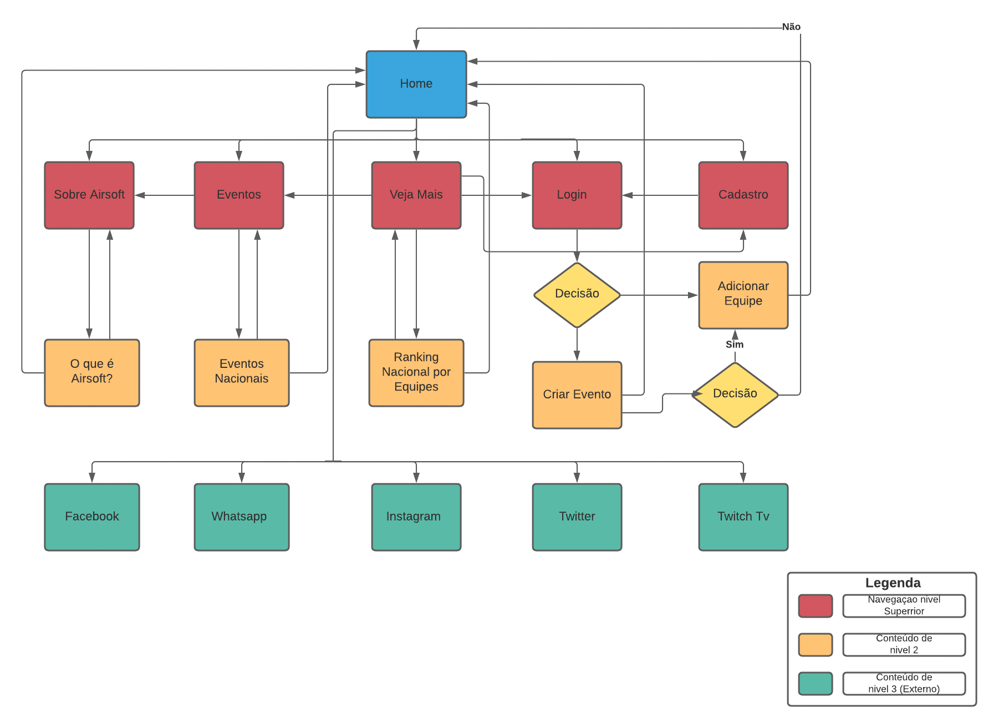
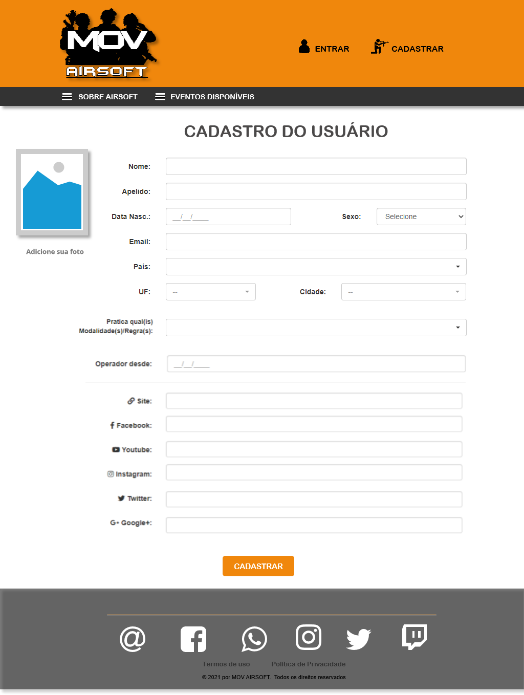

# Projeto de Interface
Dentre as preocupações para a montagem da interface do sistema, estabelecemos um foco em questões como simplificar a vida dos esportistas, sendo dinâmico, interativo e acessível e para diversos usuários. Desta forma, o projeto tem uma identidade visual padronizada em todas as telas que são projetadas para funcionamento em desktops e dispositivos móveis.

## Diagrama de Fluxo
O diagrama apresentado na Figura X mostra o fluxo de interação do usuário pelas telas do sistema. Cada uma das telas deste fluxo é detalhada na seção de Wireframes que se segue. Para visualizar o wireframe interativo, acesse o https://marvelapp.com/prototype/5e2jadg

## Wireframes
Conforme fluxo de telas do projeto, apresentado no item anterior, as telas do sistema são apresentadas em detalhes nos itens que se seguem. Para visualizar o wireframe interativo, acesse o ambiente MarvelApp do projeto. As telas apresentam as estruturas Header, Navegator e o Footer em comum, apenas a Main que sofrerá alterações de informações, como demonstrado a seguir:

•	Header- local onde são dispostos elementos fixos de identidade; 

•	Navegator - apresenta os elementos de navegação secundária; 

•	Main- apresenta informações importantes dependo da tela que usuário esteja navegando; 

•	Footer – apresenta o acesso as redes sociais, termos de uso e políticas da empresa. 

### Tela - Home-Page
A tela de home-Page com base na estrutura padrão, o Main traz a possiblidade de criar eventos e adicionar equipes e em destaque observaremos três equipes de acordo com o ranking nacional. 

 
### Tela – Entrar
Na tela de login o usuário poderá acessar uma área privada através do e-mail e senha, tendo a possibilidade de se cadastrar caso seja um usuário novo e solicitar nova senha caso tenha esquecido a mesma. O Header, Navegator e Footer apresentam os mesmos elementos da Home-Page. 

 
### Tela - Cadastrar
A tela de cadastro o usuário de digita alguns dados pessoais e se classifica de acordo com a sua modalidade. O Header, Navegator e Footer apresentam os mesmos elementos da Home-Page.

 
### Tela - Sobre Airsoft
Na tela Sobre o Airsoft traz informações essenciais sobre o esporte. O Header, Navegator e Footer apresentam os mesmos elementos da Home-Page.

### Tela – Eventos Disponíveis
Na tela Eventos disponíveis o usuário terá acesso aos eventos criados e disponíveis no momento para que ele possa se inscrever no mesmo. O Header, Navegator e Footer apresentam os mesmos elementos da Home-Page.

### Tela - Criar Eventos
Nesta tela o usuário terá a possibilidade de criar um evento de Airsoft disponibilizando dados como endereço, data do evento e uma breve descrição sobre o evento. O Header, Navegator e Footer apresentam os mesmos elementos da Home-Page.

### Tela - Adicionar Equipes
Nesta tela o usuário informa dados sobre a equipe a ser adicionada para se inscreverem em eventos futuros. O Header, Navegator e Footer apresentam os mesmos elementos da Home-Page.

### Tela - Veja Mais
Nesta tela o usuário terá a possibilidade de visualizar mais equipes de acordo com sua classificação no Ranking Nacional por equipes. O Header, Navegator e Footer apresentam os mesmos elementos da Home-Page.

