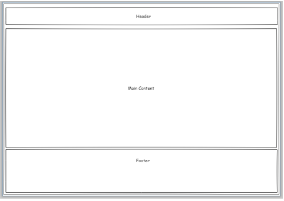

# Template Padrão da Aplicação

O padrão de layout a ser utilizado pelo site tem correspondência ao projeto de Interface elaborado anteriormente, conforme Figura X.

O Template criado está disponível no site https://github.com/ICEI-PUC-Minas-PMV-ADS/pmv-ads-2021-2-e2-proj-int-t3-tapunk 
