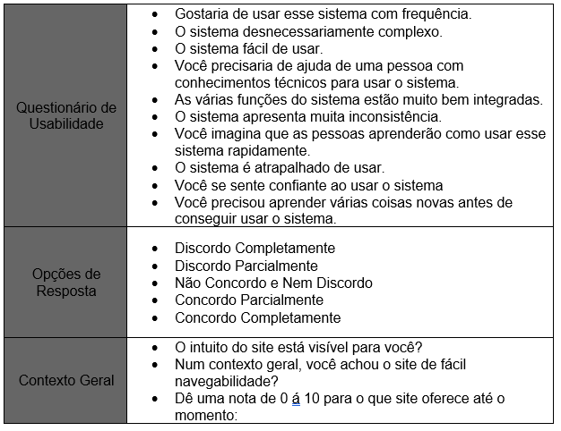

# Plano de Testes de Usabilidade

Para o planejamento dos testes de usabilidade a aplicação será disponibilizada para homologação dos usuários, onde será avaliado sua interação com o sistema e se corresponde as suas expectativas, o método de avaliação será o System Usability Scale (SUS), aplicando um questionário com 10 questões fechadas que estarão disponíveis através do Google Forms, após o término da interação com sistema o usuário irá responder as questões abaixo:

