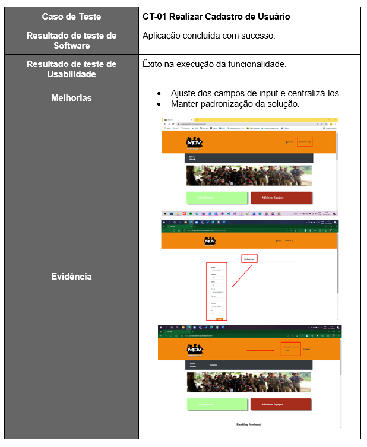
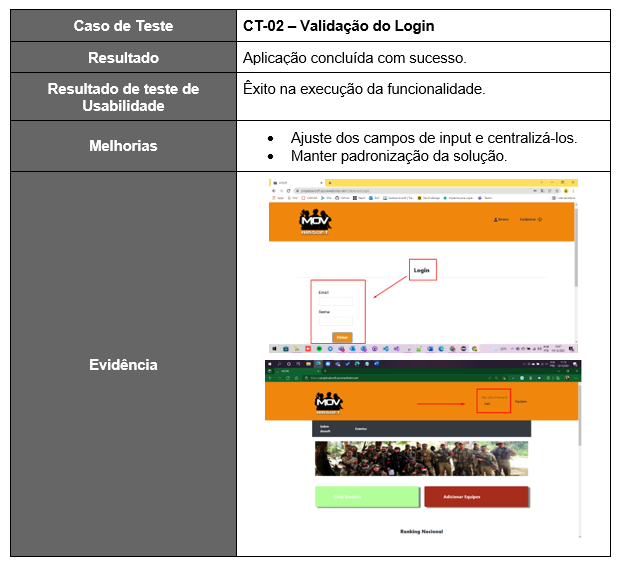
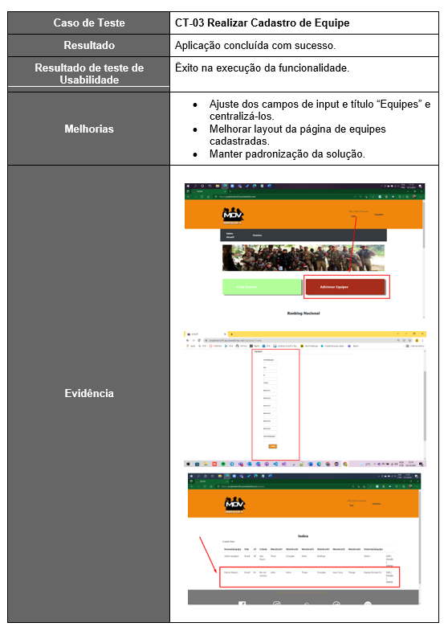
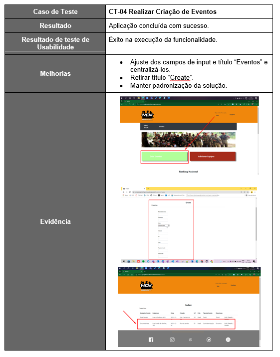
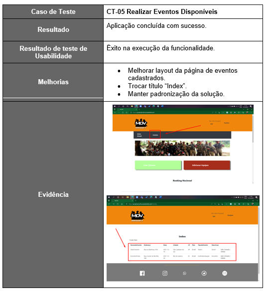
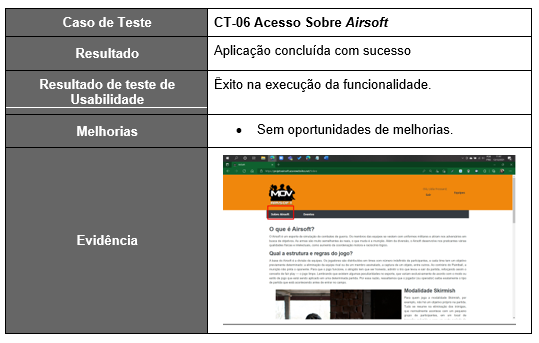
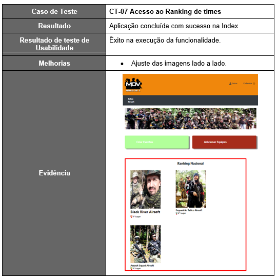

# Registro de Testes de Software

Em termos gerais dos testes de software a solução apresentou melhora significativa dos registros de testes de software feito 
anteriormente. Quanto a usabilidade as funcionalidades são entregues, porém existem algumas oportunidades de melhorias em geral ligas
ao layout. O projeto segue hospedado em https://projetoairsoft.azurewebsites.net/ . Detalhes das evidências elencadas a seguir:
 

